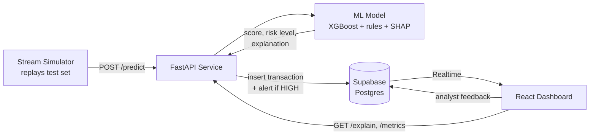

# Real-Time Fraud Detection & Risk Scoring

An end-to-end fraud detection system: machine-learning models trained on 284,807 real credit card transactions, served through a low-latency FastAPI service, fed by a real-time transaction stream, stored in Supabase, and monitored from a live React analyst dashboard. Every transaction gets a fraud probability, a LOW / MEDIUM / HIGH risk level, and a SHAP explanation of *why* — and analysts can review alerts and send feedback, just like in a production fraud operations team.

> 🚧 **Status:** in development. Results and setup instructions will be filled in as each phase is completed.

## Features

**Machine learning**
- Time-based train / validation / test split (no data leakage from the future)
- Four models compared: Logistic Regression, Decision Tree, Random Forest, XGBoost
- Three imbalance strategies compared: class weights, SMOTE, undersampling (fraud is only 0.17% of data)
- Evaluated with metrics that matter for rare events: PR-AUC, precision, recall, F1, recall at 90% precision, and dollars saved — not accuracy
- Cost-based decision threshold (missed fraud vs. analyst review cost)
- Calibrated probabilities
- Per-transaction SHAP explanations

**API**
- FastAPI endpoints: `/predict`, `/predict/batch`, `/explain/{id}`, `/health`, `/metrics` (p50/p95 latency)
- Hybrid scoring: ML model + a small rules layer
- LOW / MEDIUM / HIGH risk levels; HIGH risk automatically raises an alert

**Real-time pipeline**
- Stream simulator replays held-out transactions at a configurable rate (e.g. 20/sec)
- Every scored transaction stored in Supabase Postgres
- Supabase Realtime pushes new transactions and alerts to the dashboard instantly

**Analyst dashboard**
- Live transaction feed
- Alert review queue — mark as confirmed fraud or false alarm (feedback loop)
- Model comparison page with precision-recall curves
- Transaction detail view with SHAP feature-contribution bars
- Secure analyst login (Supabase Auth + Row Level Security)

**Production-ready**
- pytest test suite, Docker Compose, GitHub Actions CI
- Drift monitoring (live score distribution vs. training)
- Deployed API (Render) and dashboard (Vercel)

## Architecture



## Tech stack

| Layer | Technologies |
|---|---|
| Machine learning | Python 3.13, pandas, scikit-learn, XGBoost, imbalanced-learn, SHAP |
| API | FastAPI, pytest |
| Database & auth | Supabase (Postgres, Realtime, Auth, Row Level Security) |
| Frontend | React, Vite, TypeScript, Tailwind CSS, Recharts |
| DevOps | Docker Compose, GitHub Actions, Render, Vercel |

## Folder structure

```
.
├── data/          # Kaggle dataset (not committed)
├── ml/            # EDA notebook and training pipeline
│   └── artifacts/ # trained model, threshold, metrics, PR curves
├── api/           # FastAPI scoring service
├── simulator/     # real-time transaction stream replayer
├── web/           # React analyst dashboard
├── supabase/      # SQL migrations
├── tests/         # pytest test suite
└── docs/          # extra documentation and screenshots
```

## Dataset

[Kaggle — Credit Card Fraud Detection (ULB)](https://www.kaggle.com/datasets/mlg-ulb/creditcardfraud): 284,807 European card transactions over two days, 492 of them fraudulent (0.17%). Features `V1`–`V28` are anonymized PCA components; `Time` and `Amount` are raw. Because the features are anonymized, the "real-time" stream is a replay of the held-out test period.

> Why not accuracy? A model that predicts "not fraud" for everything scores **99.83% accuracy** and catches zero fraud. This project reports PR-AUC, recall at fixed precision, and cost saved instead.

## Results

*To be filled in after Phase 2 (model training). All numbers are on the held-out, time-based test set.*

| Model | Imbalance strategy | PR-AUC | Precision | Recall | F1 | Recall @ 90% precision | Cost saved |
|---|---|---|---|---|---|---|---|
| Logistic Regression | TBD | – | – | – | – | – | – |
| Decision Tree | TBD | – | – | – | – | – | – |
| Random Forest | TBD | – | – | – | – | – | – |
| XGBoost | TBD | – | – | – | – | – | – |

**API latency:** p50 – ms, p95 – ms *(to be measured in Phase 3)*

## How to run

*Placeholder — detailed steps will be added as each component is built.*

1. **Clone the repo** and download `creditcard.csv` from Kaggle into `data/`.
2. **Set up Python:** create a Python 3.13 virtual environment and install `requirements.txt` (on macOS, XGBoost also needs `brew install libomp`).
3. **Configure secrets:** copy `.env.example` to `.env` and fill in your Supabase keys.
4. **Train models:** run the training pipeline in `ml/` → artifacts saved to `ml/artifacts/`.
5. **Start the API:** run the FastAPI service from `api/`.
6. **Apply database migrations:** run the SQL in `supabase/` against your Supabase project.
7. **Start the dashboard:** install and run the React app in `web/`.
8. **Start the stream:** run the simulator to replay transactions at e.g. 20/sec.
9. **Or run everything with Docker Compose** *(Phase 7)*.

## Roadmap

- [x] Phase 0 — Setup
- [ ] Phase 1 — Exploratory data analysis
- [ ] Phase 2 — Training pipeline & model comparison
- [ ] Phase 3 — FastAPI service
- [ ] Phase 4 — Supabase integration
- [ ] Phase 5 — Stream simulator
- [ ] Phase 6 — React dashboard
- [ ] Phase 7 — Docker, CI, deployment
