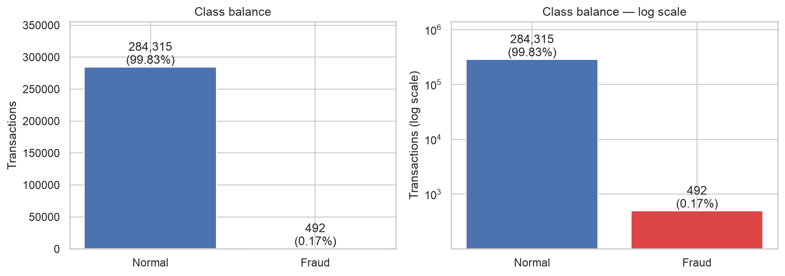
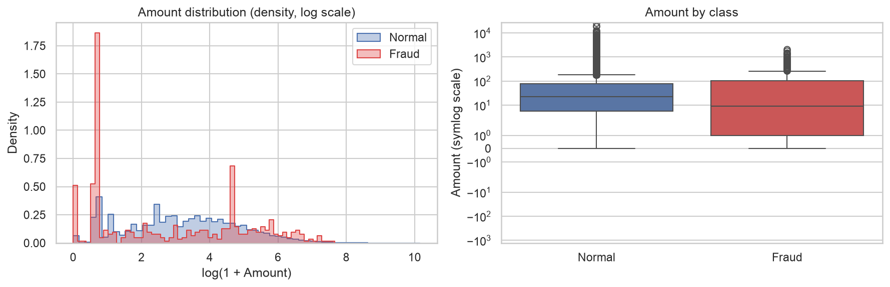
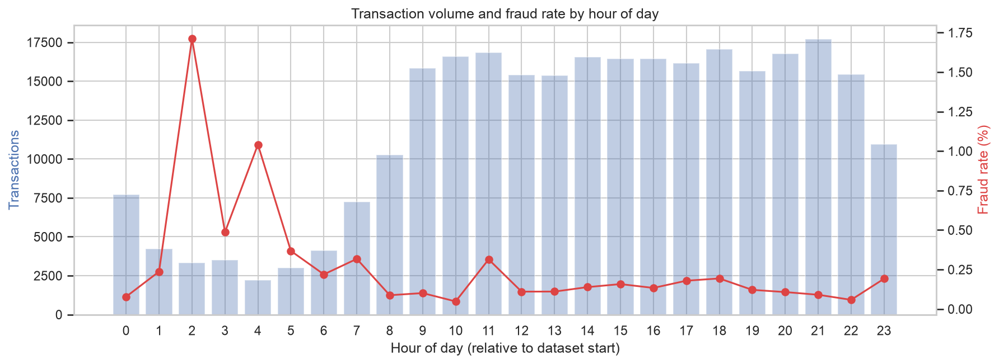
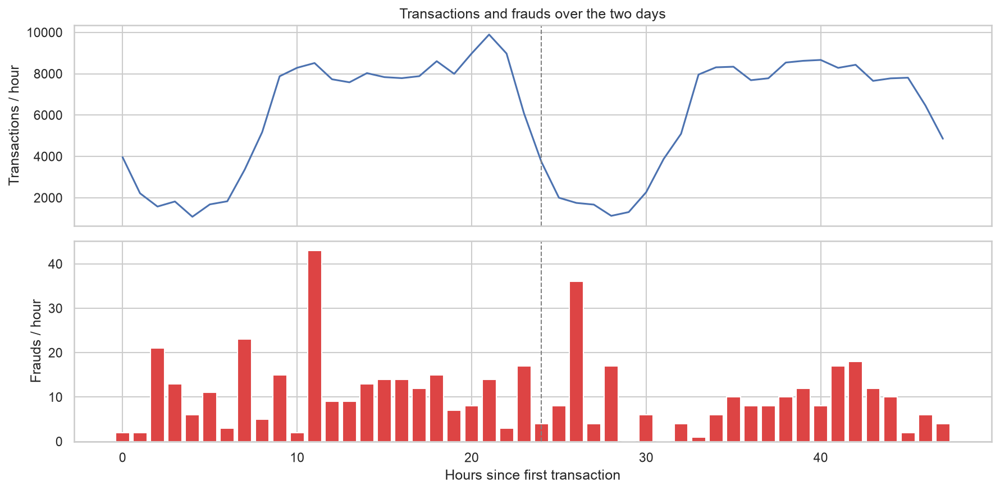
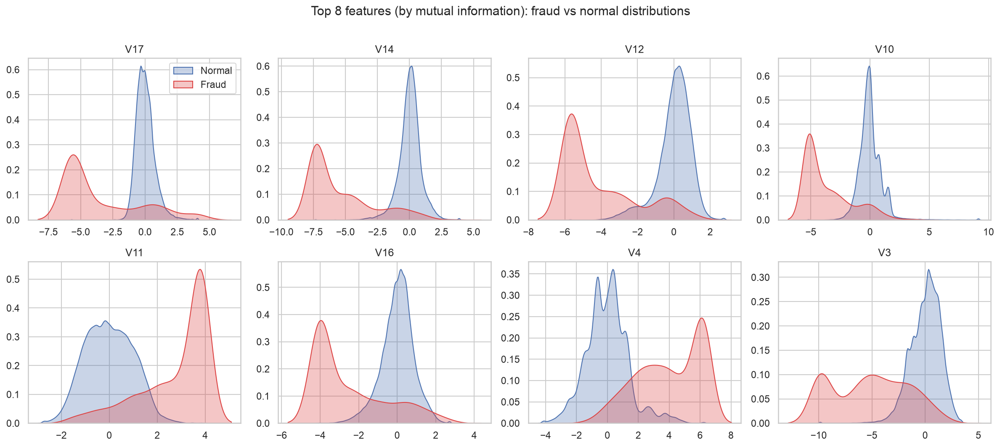
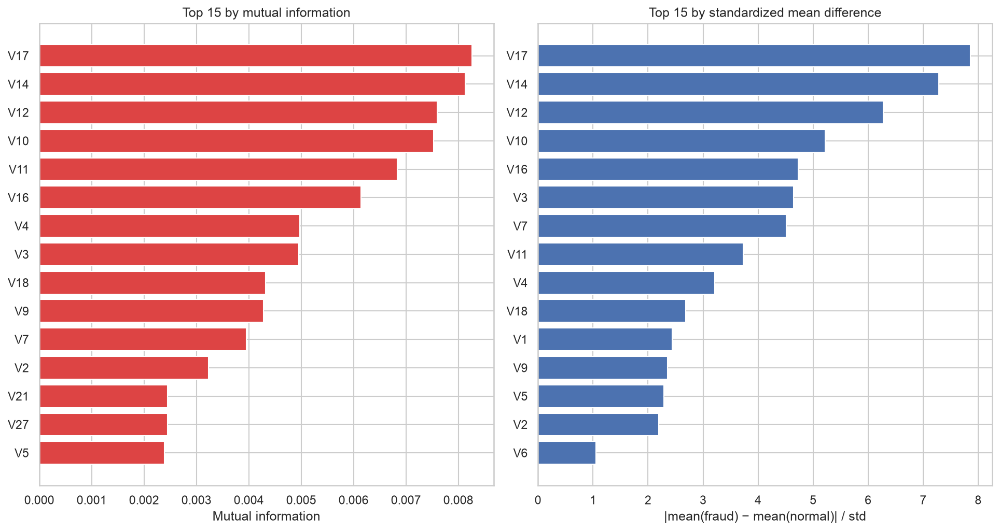
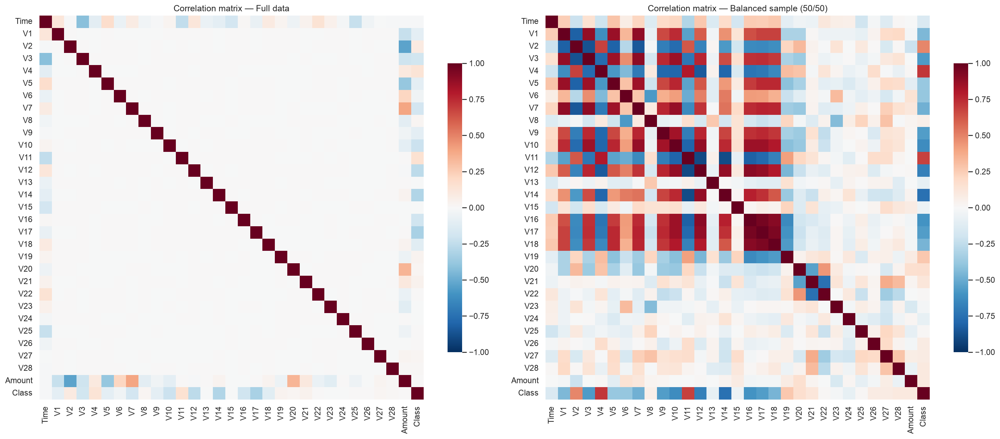
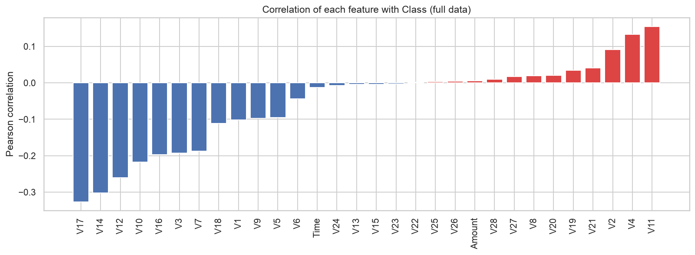
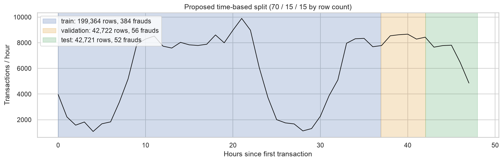

# EDA findings

From [`ml/notebooks/01_eda.ipynb`](../ml/notebooks/01_eda.ipynb), run on the full Kaggle dataset (284,807 transactions, 31 columns). Charts are in [`docs/figures/`](figures/).

1. **The data is clean.** No missing values, and every column is numeric (30 float, 1 int `Class`). `V1`–`V28` are already scaled PCA components; only `Time` and `Amount` are raw.
   → *Phase 2:* no imputation needed. Scale only `Amount` (and any time feature we derive), and fit the scaler on the training split only.

2. **There are 1,081 exact duplicate rows (0.38%), 19 of them fraud.** Each duplicate has the same `Time` as its original, and the split keeps equal timestamps together, so a duplicate never ends up in a different split from its original (no train→test leakage).
   → *Phase 2:* keep duplicates in validation/test, since repeats happen in real traffic. Optionally drop them from train and check whether metrics change.

3. **Fraud is extremely rare: 492 of 284,807 transactions (0.173%).** A model that always answers "normal" gets 99.83% accuracy and catches no fraud at all. 
   → *Phase 2:* never report accuracy. Use PR-AUC, precision/recall/F1, recall at 90% precision, and cost saved. Compare class weights, SMOTE and undersampling, applied to the training split only.

4. **Fraud amounts look different from normal ones.** The median fraud is smaller ($9.25 vs $22.00) but the average is larger ($122 vs $88). 5.5% of frauds are $0.00 (vs 0.6% of normal transactions), which looks like "card testing". The largest fraud is $2,126 and total fraud is $60,128. 
   → *Phase 2:* `Amount` is weak on its own (22nd of 30 by mutual information) but it is needed for the **cost-saved** metric. It is heavily skewed, so use `log1p` or robust scaling for Logistic Regression (tree models don't need scaling). A `$0` rule is a good candidate for the Phase 3 rules layer.

5. **Fraud is concentrated at night.** Volume drops sharply in hours 1–7 (relative to the start of the data, which looks like midnight). In those hours the fraud rate jumps: 1.71% in hour 2 and 1.04% in hour 4, against about 0.1–0.2% during the day. 
   → *Phase 2:* add an `hour_of_day` feature (or sine/cosine of it). Don't feed raw `Time` to the model, because it only says where a row sits in a 2-day window and won't generalize.

6. **Fraud arrives in bursts.** Some single hours have 50+ frauds while their neighbours have fewer than 10 (see the timeline). 
   → *Phase 2:* this is why the split must follow time. A random split would put pieces of the same fraud burst in both train and test and make the scores look better than they are.

7. **A handful of features separate fraud very strongly.** The top features are V17, V14, V12, V10, V11, V16, V4 and V3. For V17 the fraud and normal averages are 7.9 standard deviations apart. Most of them are *lower* for fraud; V11 and V4 are *higher*.  
   → *Phase 2:* we expect even simple models to do well. When SHAP is ready, these features should be at the top of its rankings, which gives us a quick sanity check.

8. **Several features carry almost no signal.** V13, V15, V22, V23, V24, V25 and V26 have near-zero mutual information and near-identical averages for both classes.
   → *Phase 2:* candidates to drop for Logistic Regression if it helps. Keep them for tree models and let the validation set decide, rather than pruning by hand.

9. **On the full data the features are uncorrelated with each other, and only weakly correlated with `Class`.** This is expected from PCA. The strongest correlation with `Class` is V17 at −0.33. On a balanced 50/50 sample, strong shared patterns among the fraud-related features show up.  
   → *Phase 2:* multicollinearity is not a concern on the real data. Pearson correlation understates signal for a rare class, so rank features with mutual information or model importance instead.

10. **Proposed 70/15/15 time split:** train = 199,364 rows / 384 frauds (0.19%), validation = 42,722 / 56 (0.13%), test = 42,721 / 52 (0.12%). The cut points are at `Time` 132,929 s and 151,329 s. 
    → *Phase 2:* use these boundaries. Three caveats:
    - (a) The fraud rate is lower in later periods, so validation and test scores will probably look worse than cross-validated training scores. That is the honest result.
    - (b) With only about 52–56 frauds, each one moves recall by about 2 points. Report test metrics with that in mind (bootstrap confidence intervals would help).
    - (c) Validation and test cover only the afternoon and evening of day 2, with **no night hours**. The night-time fraud spike in finding 5 is learned in training but barely tested.
